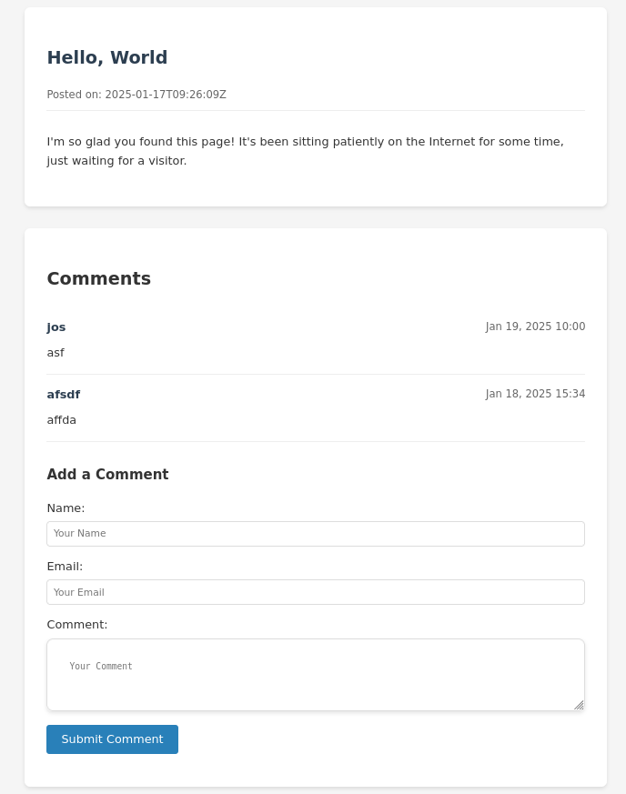

# Web Application with MySQL and TLS Support

This is a Go-based web application that connects to a MySQL database and serves content securely over HTTPS. It supports dynamic configuration using environment variables.

## Screenshot

## Prerequisites

- Go (1.17 or later)
- MySQL database
- Valid TLS certificate and key files
- [godotenv](https://github.com/joho/godotenv) for managing environment variables (optional but recommended)

## Configuration

The application uses environment variables for configuration. You can define these variables in a `.env` file for simplicity.

### Generate OpenSSL Cert

openssl req -x509 -newkey rsa:4096 -keyout key.pem -out cert.pem -days 365 -nodes

```
```
### Environment Variables

| Variable    | Default Value     | Description                        |
|-------------|-------------------|------------------------------------|
| `DB_HOST`   | `127.0.0.1`       | Database host                     |
| `DB_PORT`   | `:3306`           | Database port                     |
| `DB_USER`   | `root`            | Database username                 |
| `DB_PASS`   | `root`          | Database password                 |
| `DB_NAME`   | `secureblog`      | Database name                     |
| `HTTP_PORT` | `:8080`           | Port for the HTTP server          |
| `HTTPS_PORT`| `:8443`           | Port for the HTTPS server         |
| `CERT_FILE` | `cert.pem`      | Path to the TLS certificate file  |
| `KEY_FILE`  | `key.pem`       | Path to the TLS key file          |

### Sample `.env` File

```env
DB_HOST=127.0.0.1
DB_PORT=:3306
DB_USER=root
DB_PASS=joshua
DB_NAME=secureblog
HTTP_PORT=:8080
HTTPS_PORT=:8443
CERT_FILE=cert.pem
KEY_FILE=key.pem
```

## Installation

1. Clone the repository:
   ```bash
   git clone <repository_url>
   cd <repository_directory>
   ```

2. Install dependencies:
   ```bash
   go mod tidy
   ```

3. Create a `.env` file in the root directory (optional) and set the required variables.

4. Ensure that the TLS certificate (`cert.pem`) and key (`key.pem`) are present at the specified locations.

## Running the Application

Start the application using:

```bash
go run main.go
```

### HTTP and HTTPS
- The application starts an HTTP server on the port specified by `HTTP_PORT`.
- An HTTPS server runs on the port specified by `HTTPS_PORT`.

## Application Endpoints

### API Endpoints
| Endpoint          | Method | Description                        |
|-------------------|--------|------------------------------------|
| `/api/pages`      | GET    | Fetch all pages                   |
| `/api/page/{guid}`| GET    | Fetch a specific page by GUID     |
| `/api/comments`   | POST   | Submit a new comment              |

### Web Routes
| Endpoint               | Method | Description                        |
|------------------------|--------|------------------------------------|
| `/home`                | GET    | Display the homepage              |
| `/page/{guid}`         | GET    | Display a specific page by GUID   |

## Logging and Errors
- All database and runtime errors are logged to the console.
- Use `log.Printf` to track key events and errors.

## Security Features
- HTTPS enabled with TLS configuration.

